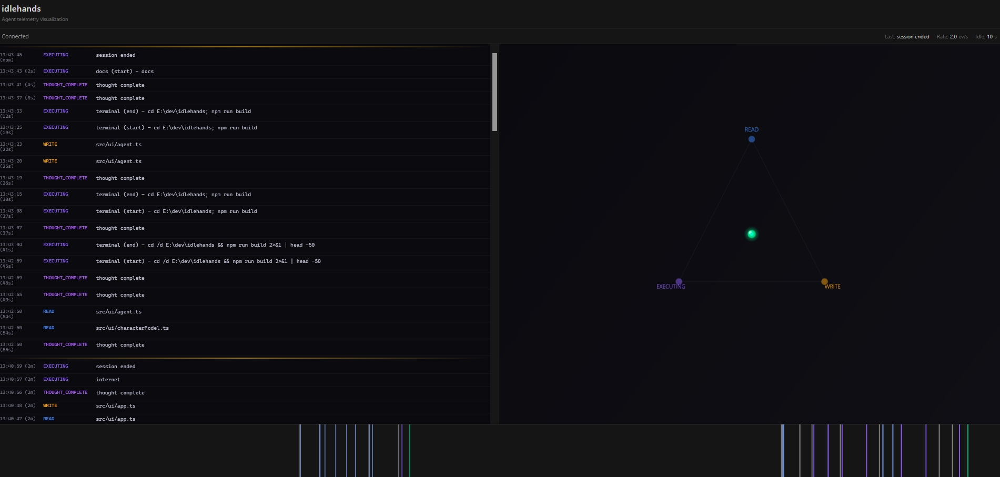

# Idlehands

An activity-centric, temporal visualization tool for Cursor agent telemetry. Watch your AI agent's behavior patterns in real-time through a time-ordered activity log and agent state transitions.

Idlehands makes AI agent behavior observable by showing activity modes, transitions, and concrete evidence in a temporal view. The system answers: "what mode is the agent in, how long has it been there, and what concrete actions are occurring?" The visual style is inspired by the Gibson scene from *Hackers*, but the system is grounded in real telemetry data from Cursor hooks—no metaphorical cyberspace.



## Quick Start

### Setting Up Idlehands

1. **Clone and build**:
   ```bash
   git clone <repo-url>
   cd idlehands
   npm install
   npm run build
   ```

2. **Install globally (recommended)**:
   ```bash
   npm install -g .
   ```
   
   This makes the `idlehands` command available from anywhere.

### Using Idlehands in a Repository

#### Option A: Add to a Different Repository (Most Common)

1. **Navigate to your target repository**:
   ```bash
   cd /path/to/your/project
   ```

2. **Install Cursor hooks**:
   ```bash
   idlehands install
   ```
   
   This creates/updates `.cursor/hooks.json` in your repository root. The install command automatically detects the repository root by looking for a `.git` directory.

3. **Restart Cursor** for hooks to take effect.

4. **Start the idlehands server** (from the idlehands repository):
   ```bash
   cd /path/to/idlehands
   npm start
   ```
   
   The server runs on `http://localhost:8765` by default.

5. **Open in your browser**:
   
   Navigate to `http://localhost:8765` to view the visualization. The UI will:
   - Load the layout (zone anchors)
   - Connect via WebSocket for real-time events
   - Display the activity log (left) and agent movement between zone anchors (right)

#### Option B: Use in the Idlehands Repository Itself

1. **Install Cursor hooks** (from the idlehands directory):
   ```bash
   cd idlehands
   node dist/cli/index.js install
   ```
   
   Or if installed globally:
   ```bash
   idlehands install
   ```

2. **Restart Cursor** for hooks to take effect.

3. **Start the server**:
   ```bash
   npm start
   ```

4. **Open in your browser**: Navigate to `http://localhost:8765`

### CLI Commands

**If installed globally:**
- `idlehands install` - Install Cursor hooks in current repository
- `idlehands uninstall` - Remove Cursor hooks from current repository
- `idlehands doctor` - Check system health

**If using from idlehands directory:**
- `node dist/cli/index.js install` - Install Cursor hooks
- `node dist/cli/index.js uninstall` - Remove Cursor hooks
- `node dist/cli/index.js doctor` - Check system health
- `node dist/cli/log.js` - Generate demo events for testing

**Note:** The `install` command automatically detects the repository root (by looking for `.git`) and installs hooks to `.cursor/hooks.json` in that repository. You can run it from any subdirectory within a git repository.

## Features

- **Activity Log Table**: Primary view showing time-ordered events with explicit mode labels (READ, WRITE, EXECUTING, THOUGHT_COMPLETE, RESPONSE_COMPLETE), timestamps, and concrete evidence (file paths, commands, tool names)
- **Real-time Streaming**: Watch agent activity as it happens via WebSocket streaming with automatic reconnection
- **Zone Anchors**: Semantic labels (READ, WRITE, EXECUTING) used as fixed anchor points for agent movement—not visual containers
- **Agent Avatar**: A character sprite that moves between zone anchors to reinforce state transitions. Renders activity-specific sprite loops (reading, writing, executing) and static poses (idle, awake). Shows current mode and dwell time. Returns to home position on session end
- **Ephemeral Beacons**: Agent states (thinking, responding) are trailing-edge events that display ephemeral emoji bubbles (💡 lightbulb for AfterAgentThought, 💬 speech balloon for AfterAgentResponse) that automatically fade out after ~4 seconds. These do not move the agent or create zones
- **Temporal Evidence**: All evidence lives in the activity log—one row per event or phase transition, with no aggregation or inference
- **Live Timeline**: Visual indicator showing the last 5 minutes of events (v0: live-only, no replay)
- **Status Panel**: Real-time metrics showing current activity mode, dwell time, events per second, and idle time
- **Privacy-First**: Only logs repo-relative paths and tool names, never file contents, diffs, prompts, or environment variables

## Layout Algorithm

The layout uses a simple activity-first, temporal system. All visual emphasis derives strictly from observable Cursor events and session-local activity over time.

1. **Two-panel layout**: 
   - **Left panel (60%)**: Activity log table—the source of truth showing all events in time order
   - **Right panel (40%)**: Agent canvas with zone anchors

2. **Zone anchors**: Fixed anchor points for agent movement, labeled with semantic mode names (arranged in a triangle):
   - **READ**: Activated by `file_touch kind=read` events
   - **WRITE**: Activated by `file_touch kind=write` events
   - **EXECUTING**: Activated by `tool_call` events (all tool calls)
   
   Note: THINKING and RESPONDING are not zones. They are trailing-edge events (AfterAgentThought/AfterAgentResponse) that only show ephemeral beacons and appear in the activity log as THOUGHT_COMPLETE and RESPONSE_COMPLETE.

3. **Activity log**: Single scrollable table showing:
   - One row per event or phase transition
   - Columns: timestamp/age, mode label, evidence (file paths, commands, tool names)
   - Newest entries first (top of list)
   - No aggregation or inference—only concrete evidence
   - Scales to long sessions without clutter

4. **Agent movement**: Agent moves between zone anchors (READ, WRITE, EXECUTING) on state transitions to reinforce current mode. Agent states (thinking, responding) are ephemeral beacons only—they show emoji bubbles that fade out after ~4 seconds but do not move the agent or create zones.

5. **Home position**: Default starting/ending position for the agent (center of agent canvas). Agent returns home on session stop events.

6. **Tool call lifecycle**: Tool calls are tracked with start/end pairs. Incomplete tool calls (missing end event) are marked as hung after a 30-second timeout but do not keep the UI stuck.

7. **WebSocket disconnect handling**: When the WebSocket disconnects, the UI shows a "Disconnected" overlay and freezes (doesn't render map/agent) until reconnection. Active tool calls are cleared on disconnect.

## Architecture

```
┌─────────────┐
│   Cursor    │
│    IDE      │
└──────┬──────┘
       │ Hooks (afterFileEdit, beforeReadFile, beforeMCPExecution, etc.)
       ▼
┌─────────────┐
│ Hook Runner │  ──►  ~/.idlehands/events.ndjson
│ (idlehands-hook)│       (NDJSON log file)
└──────┬──────┘
       │ POST /api/event
       ▼
┌─────────────┐
│   Server    │  ◄──►  WebSocket /ws
│  (Node.js)  │       (Real-time streaming)
└──────┬──────┘
       │ GET /api/layout, /api/events
       ▼
┌─────────────┐
│  Web UI     │
│  (Canvas)   │
└─────────────┘
```

### Components

- **Hook Runner** (`src/hook/runner.ts`): Executed by Cursor hooks, extracts events from payloads and sends to server
- **Server** (`src/server/index.ts`): HTTP server serving UI, API endpoints, and WebSocket connections
- **Layout Engine** (`src/server/layout.ts`): Simple layout with zone anchors for agent movement (no filesystem scanning)
- **Payload Extractor** (`src/model/payload.ts`): Robust extraction of file paths, commands, URLs, and tool calls from Cursor's hook payloads
- **State Machine** (`src/ui/state.ts`): Canonical agent state machine managing transitions between reading, writing, and executing. Agent states (thinking, responding) are ephemeral beacons only and do not cause state transitions.
- **UI Components**:
  - `ActivityLog`: Primary activity log table showing time-ordered events with mode labels and evidence
  - `MapRenderer`: Renders zone anchors (semantic labels, not visual containers)
  - `AgentController`: Manages agent movement between zone anchors with constant-speed motion and a slowly decaying trail. Renders character sprites with activity-specific animations via `CharacterModel`
  - `CharacterModel`: Loads and manages sprite assets, handles animation frame advancement for activity loops (reading, writing, executing), and provides current sprite for rendering
  - `Timeline`: Live event timeline indicator (v0: no replay/scrubbing)

## UI Controls

- **Activity Log**: Scrollable table showing all events in time order (newest first)
- **Status Panel**: Shows current activity mode, dwell time, events per second, and idle time

## Event Types

### File Touch
```json
{
  "v": 1,
  "ts": 1234567890.123,
  "type": "file_touch",
  "session_id": "session_123",
  "path": "src/ui/map.ts",
  "kind": "read" | "write"
}
```

### Tool Call
```json
{
  "v": 1,
  "ts": 1234567890.123,
  "type": "tool_call",
  "session_id": "session_123",
  "tool": "terminal",
  "phase": "start" | "end",
  "command": "npm run build"
}
```

The `tool` field is a string identifying the tool being used. Terminal tool calls transition the agent to the terminal activity zone. The optional `command` field contains the actual command string for terminal/shell executions, which is displayed in the terminal evidence panel.

### Agent State
```json
{
  "v": 1,
  "ts": 1234567890.123,
  "type": "agent_state",
  "session_id": "session_123",
  "state": "thinking" | "responding",
  "metadata": {
    "duration_ms": 1234,
    "model": "gpt-4",
    "generation_id": "gen_123",
    "text_preview": "..."
  }
}
```

Agent state events are created from `afterAgentThought` and `afterAgentResponse` hooks. These are trailing-edge events (they occur after the agent has finished thinking/responding). They:
- Display ephemeral emoji bubbles (💡 for AfterAgentThought, 💬 for AfterAgentResponse) that fade out after ~4 seconds
- Appear in the activity log as THOUGHT_COMPLETE and RESPONSE_COMPLETE
- Do not move the agent or create activity zones (they are not duration-based states)
- Do not cause state transitions in the state machine

### Session
```json
{
  "v": 1,
  "ts": 1234567890.123,
  "type": "session",
  "session_id": "session_123",
  "state": "start" | "stop"
}
```

Session events mark session boundaries. On session stop, the agent returns to home position and all active tool calls are cleared.

## Configuration

### Layout Parameters

Edit `src/server/layout.ts` to adjust:
- `logAreaWidth`: Width fraction for activity log (default: 0.6)
- `agentAreaWidth`: Width fraction for agent canvas (default: 0.4)
- `referenceWidth` / `referenceHeight`: Reference canvas dimensions for scaling

### Sprite Assets

Character sprites are loaded from `/assets/` (served as static files from `src/ui/assets/` or `dist/ui/assets/`). Required sprite files:
- Static sprites: `agent_idle.png`, `agent_awake.png`
- Animation loops (3 frames each): `reading_1.png`, `reading_2.png`, `reading_3.png`, `writing_1.png`, `writing_2.png`, `writing_3.png`, `executing_1.png`, `executing_2.png`, `executing_3.png`

If sprites fail to load, the agent falls back to gradient rendering. Animation frame interval is configurable in `CharacterModel` (default: 600ms per frame).

### Server Port

Set `IDLEHANDS_PORT` environment variable or edit `src/server/index.ts` (default: 8765).

## Troubleshooting

### Agent Not Moving

1. **Verify events are file_touch, tool_call, agent_state, or session** (not `unknown`)
2. **Check activity transitions**: Agent moves between zone anchors (READ, WRITE, EXECUTING) based on event types. Agent states (thinking, responding) are ephemeral beacons only—they show emoji bubbles but don't move the agent or create zones.
3. **Verify layout loaded**: Check network tab for `/api/layout` response (should show 3 zones in triangle layout)
4. **Check browser console** for any error messages
5. **Check server logs**: Unknown events now include metadata (model, duration, etc.) to help identify them
6. **Agent should return home**: On session stop events, the agent should return to the home position (center of canvas)

### Hooks Not Firing

1. **Verify hooks.json** exists in `.cursor/hooks.json`
2. **Check hook runner path**: Should point to `dist/hook/runner.js`
3. **Restart Cursor** after installing hooks
4. **Check debug log**: `~/.idlehands/hook-debug.log` (if `IDLEHANDS_DEBUG` is set)

### Events Not Appearing

1. **Check server console** for event reception logs
2. **Verify WebSocket connection**: Browser console should show connection
3. **Check event log file**: `~/.idlehands/events.ndjson`
4. **Run `idlehands doctor`** to check system health

### Activity Log Not Showing Events

If the activity log is empty:
- Verify events are being received (check server console)
- Check that events have valid types (file_touch, tool_call, agent_state, session)
- Check browser console for any JavaScript errors
- Verify WebSocket connection is established (check network tab)

## Development

### Project Structure

```
idlehands/
├── src/
│   ├── cli/          # CLI commands (install, doctor, log)
│   ├── hook/         # Cursor hook runner
│   ├── model/        # Event models and payload extraction
│   ├── server/       # HTTP server, layout, WebSocket
│   ├── ui/           # Web UI (Canvas rendering)
│   └── utils/        # Utilities (logging, paths)
├── dist/             # Compiled output
├── .cursor/          # Cursor hooks configuration
└── package.json
```

### Building

```bash
npm run build
```

This compiles TypeScript and copies UI assets to `dist/`.

### Development Mode

```bash
npm run dev
```

Runs TypeScript compiler in watch mode.

### Testing Hooks Locally

```bash
# Generate demo events
node dist/cli/log.js

# Check what hooks would receive
echo '{"file_path": "src/test.ts", "hook_event_name": "afterFileEdit"}' | node dist/hook/runner.js
```

## Privacy & Security

All data is stored locally (`~/.idlehands/`). Idlehands logs only repo-relative file paths and tool names—never file contents, diffs, prompts, AI responses, or environment variables.

## Limitations

- **Live Mode Only (v0)**: Timeline shows only the last 5 minutes; replay and scrubbing are deferred
- **Activity Log**: Shows up to 10,000 entries (newest first); older entries are removed
- **Zone Anchors**: Fixed set of three activity zones (READ, WRITE, EXECUTING) arranged in a triangle; no custom zones
- **Agent States**: Thinking and responding are trailing-edge events (AfterAgentThought/AfterAgentResponse) that show ephemeral emoji bubbles (💡, 💬) that fade out after ~4 seconds. They appear in the activity log as THOUGHT_COMPLETE and RESPONSE_COMPLETE but do not create zones or cause state transitions.
- **Tool Call Timeout**: Incomplete tool calls (missing end event) are marked as hung after 30 seconds but do not keep the UI stuck
- **WebSocket Disconnect**: UI freezes and shows "Disconnected" overlay when WebSocket disconnects; auto-reconnects after 3 seconds
- **No Filesystem Visualization**: Filesystem structure is not visualized; files are evidence text only in the activity log
- **No Static Repository Properties**: All visual emphasis derives strictly from observable Cursor events and session-local activity

## Future Improvements

- [ ] Timeline replay and scrubbing
- [ ] Activity log filtering and search
- [ ] Multiple agent avatars for concurrent sessions
- [ ] Export/import event logs
- [ ] Activity log pagination for very long sessions

## License

MIT License - Copyright (c) 2026 Joe Norton

## Credits

Inspired by the Gibson visualization scene from the 1995 film *Hackers*. Then when that didn't workout, I was inspired by the 1999 film *Idle Hands*.
